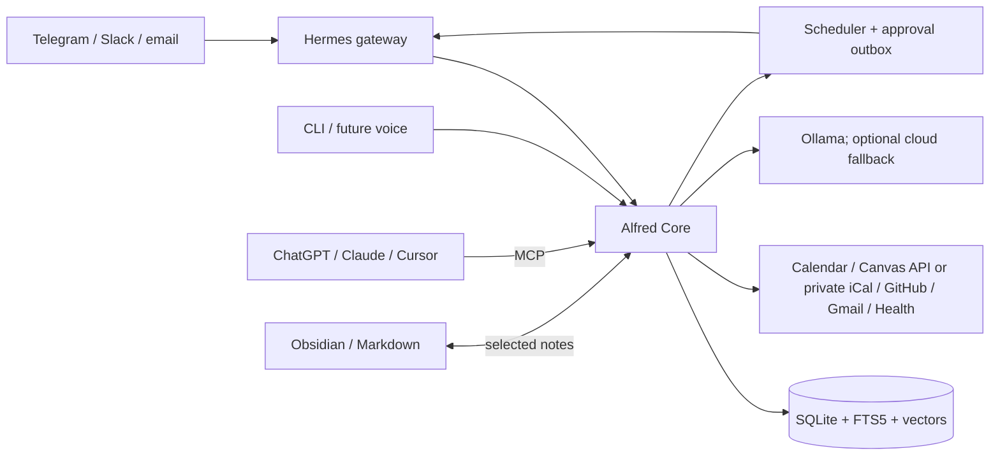

# Alfred architecture

Status: local implementation operating; slices 1-5 are built, later connector smoke tests remain<br>
Last verified: 2026-08-13<br>
Goal: a cheap, local-first, open-source personal secretary that remembers, briefs, and acts across many clients and services.

> Canonical rule: store broadly, retrieve narrowly, act cautiously. Never put the full archive in an LLM prompt.

**Plain English:** SQLite is Alfred's private filing cabinet. A small knowledge graph is the map showing how the important things in that cabinet relate. Obsidian is an optional notebook where the owner can inspect and edit selected memories. Telegram is the free phone remote. The filing cabinet remains authoritative, so no model, chat app, or note-taking app can lock Alfred's memory away.

## 1. Decisions

1. **Do not fork Hermes yet.** Use upstream Hermes as the agent runtime and messaging gateway. Publish Alfred as a Hermes profile distribution plus a standalone `alfred-core` package. Fork only if a required core change cannot be implemented through a profile, skill, plugin, memory provider, or MCP boundary.
2. **Alfred Core owns the data.** Hermes, ChatGPT, Claude, Cursor, Telegram, and future voice clients are replaceable interfaces. None is the source of truth.
3. **Run a modular monolith on the always-on PC.** One Python service and one SQLite database are cheaper and easier to back up than microservices. Split services only after measured need.
4. **Use MCP in both directions.** Alfred serves stable personal-assistant tools to AI clients and consumes MCP tools where useful. Durable background sync should use official provider APIs, not depend on an interactive MCP client.
5. **Use Telegram first.** Its bot platform is free and supports long polling, so the PC needs no inbound public port. Add Slack and email later. iMessage is last because Apple has no comparable general-purpose bot API; practical bridges require an always-on Mac and add fragility.
6. **Use local inference by default.** Ollama handles embeddings, extraction, classification, summaries, and routine tool selection when hardware permits. The deployed Hermes profile currently uses Nous Portal's free model for interactive speed, with only local Ollama fallback: Alfred redacts common PII at the final subprocess boundary, enforces a hard monthly call count, caps packed context, and has no paid-provider fallback.
7. **Target Google Health API, not legacy Fitbit Web API.** The legacy Fitbit API is scheduled to stop syncing in September 2026.
8. **Start read-only.** Calendar, Canvas, GitHub, mail, and health begin as readers. Enable narrowly scoped writes only after audit logs, idempotency, and approvals work.
9. **License new Alfred code Apache-2.0.** Keep Hermes as an upstream MIT dependency and retain third-party notices. User data, tokens, memories, and logs never ship in the distribution.
10. **Build a lightweight knowledge graph inside SQLite.** Use Trayce-style typed, temporal entities and relationships with confidence and provenance. Do not add Neo4j or another graph database until measurements prove SQLite inadequate.
11. **Make Obsidian an optional, free projection.** Alfred never requires paid Obsidian Sync. Selected memories are ordinary Markdown, and Alfred continues to work with no Obsidian installation or with any Markdown editor.
12. **Keep academic history evidence-first.** Calendar and Canvas source events are immutable authority; compact JSON rollups and semantic memories are derived, rebuildable projections with source-event provenance. Cognee or another graph/vector engine may be benchmarked as an optional retriever, but never becomes canonical without measured retrieval gains and equivalent correction/forget guarantees.

## 2. System shape



There are two independent planes:

- **Data plane — `alfred-core`:** memory, tasks, reminders, connectors, briefing, policy, audit, and MCP.
- **Agent plane — Hermes:** conversation loop, model/provider selection, skills, sandboxed task execution, gateway UX, and channel delivery.

Alfred Core is the sole owner of user schedules, reminders, retries, and the delivery outbox. It hands due output to a narrow Hermes delivery adapter. Hermes's native cron is disabled for user work (or limited to runtime health checks), preventing two job stores from drifting.

Hermes connects to Alfred Core over local stdio MCP. Claude Desktop/Code and Cursor can use the same stdio entry point. Remote clients use Streamable HTTP. ChatGPT cannot connect directly to a local MCP server; use OpenAI's outbound-only Secure MCP Tunnel for a private installation. A public Alfred service would instead require stable HTTPS and OAuth.

ChatGPT and Claude subscriptions are not API credits. When they are MCP clients, their UI supplies the model. When Alfred runs unattended, it needs Ollama or separately billed API access.

The phone does not connect to SQLite or require Obsidian. It messages the Telegram bot, Hermes passes the request to Alfred Core on the PC, and Alfred replies with current memory and tasks. This works while the PC is awake. Optional Markdown sync can make selected Obsidian notes available offline on the phone, but it is not part of Alfred's control path.

## 3. Components

### Hermes distribution

The Alfred distribution contains only shareable behavior:

```text
distribution.yaml
SOUL.md                  # voice, boundaries, compact operating rules
config.yaml              # safe defaults; user overrides survive updates
mcp.json                 # starts/connects to alfred-core
skills/                  # morning brief, inbox triage, weekly review
cron/                    # optional runtime health checks only
README.md
```

Hermes's built-in memory remains a tiny bootstrap/persona cache. Alfred Core is canonical to avoid split-brain memory. Hermes session history may be imported into Alfred's event log, but Alfred never writes directly to Hermes internals.

### Alfred Core modules

| Module | Responsibility |
|---|---|
| `ingest` | Accept messages/webhooks/polls; deduplicate; append source events. |
| `memory` | Extract, validate, graph, version, retrieve, correct, export, and forget memories. |
| `vault` | Optionally import and project selected memories as portable Markdown. |
| `tasks` | Canonical tasks, commitments, reminders, and status transitions. |
| `connectors` | OAuth, sync cursors, normalized reads, and scoped actions. |
| `briefing` | Deterministic gather/rank, then one optional LLM writing pass. |
| `policy` | Identity, sensitivity, client scopes, approvals, and cloud egress. |
| `jobs` | Persistent schedules, retries, misfires, and delivery outbox. |
| `mcp` | One semantic tool surface over stdio and Streamable HTTP. |
| `models` | Ollama first; optional OpenAI/Anthropic-compatible adapters and budgets. |
| `audit` | Append-only tool/action records with redacted arguments and outcomes. |

Implementation baseline: Python, `uv`, Pydantic, official MCP Python SDK, SQLite in WAL mode, FTS5, and `sqlite-vec`. Use the same core functions from CLI, jobs, HTTP, and MCP; transports contain no business logic.

### Connector contract

Every connector implements the same narrow interface:

```text
authorize() -> account
sync(cursor) -> events + next_cursor
query(request) -> normalized records
propose(action) -> preview
execute(approved_action, idempotency_key) -> receipt
health() -> status
```

Each connector declares read/write capabilities, OAuth scopes, sensitivity, polling/webhook support, and rate limits. A normalized event always retains `source`, `account`, `external_id`, timestamps, and a deep link to the original.

Prefer official APIs for reliable sync. Third-party MCP servers are acceptable for optional/ad-hoc tools, but must be allowlisted and cannot receive Alfred secrets other than their own scoped credential.

When an institution disables student-generated Canvas API tokens, Alfred may
use Canvas's official private iCalendar feed as a degraded read-only source.
The feed URL is a bearer secret held only in the operating-system keyring.
Sync uses bounded full snapshots plus ETag/Last-Modified validators; SQLite and
audit records retain no feed URL, query token, or event description. This path
provides dated assignments and events, not grades, submissions, To Do state, or
complete history, and must not be mistaken for full Canvas API parity.

## 4. Memory: what “remember everything” means

Alfred keeps an inspectable archive of consented inputs, not an impossible infinite prompt.

### Layers

1. **Raw event log:** immutable user messages and normalized source events. This is the recoverable truth.
2. **Documents/chunks:** searchable text or attachment metadata linked to raw events.
3. **Derived memory and graph:** facts, preferences, people, projects, decisions, habits, commitments, and their relationships. Each claim has provenance, confidence, validity dates, sensitivity, and version history.
4. **Working context:** a small request-specific pack assembled at runtime.

Corrections supersede old derived memories; they do not rewrite history. Conflicting facts remain visible until resolved. External mail/files are indexed by ID, metadata, and minimal excerpts by default rather than copied wholesale. Users can export or delete by source, time range, person, topic, or individual item.

### Core records

| Record | Essential fields |
|---|---|
| `events` | source, external ID, occurred/ingested time, content, metadata, sensitivity, hash |
| `documents` | event ID, URI/path, MIME type, checksum, retention policy |
| `memories` | kind, statement, confidence, valid range, source refs, supersedes, status |
| `entities` / `edges` | people/projects/courses and typed relationships |
| `tasks` | title, state, priority, due time, source, recurrence, owner |
| `jobs` / `outbox` | schedule, next run, payload, attempts, idempotency key, delivery state |
| `tool_runs` / `approvals` | actor, client, tool, redacted input, decision, result, timestamp |
| `sync_state` | connector account, cursor, last success/error, backoff |

Retrieval is hybrid: FTS5 keyword match + vector similarity + time/importance/entity filters, followed by lightweight reranking. Embeddings are generated locally and versioned by model so they can be rebuilt. Promote to Postgres/pgvector only if multi-user operation or measured SQLite limits require it.

### Learning loop

- Save explicit statements and corrections immediately with provenance.
- Extract implicit preferences as low-confidence candidates; promote only after repetition or confirmation.
- Turn repeated workflows into versioned skills only after showing a diff for approval.
- Record accepted/rejected suggestions and retrieval misses as evaluation data.
- Do not fine-tune in the MVP. Better memory, retrieval, policies, and evals produce safer learning at far lower cost.

**Built:** the conversational runner now applies this loop after delivering
each reply. A deterministic local extractor handles explicit memory requests
and high-precision first-person preferences, identity facts, and goals.
Implicit observations remain `candidate` until corroborated by another source
event; sensitive observations never auto-promote and secret-shaped statements
are discarded. Confirmed recall is injected into the bounded runtime context,
while corrections supersede rather than overwrite and retrieval feedback is
stored append-only for evaluation. The extraction interface remains pluggable
so a stronger local structured-output model can be evaluated later without
changing Alfred's authoritative schema or promotion policy.

**Built:** successful Telegram responses expose explicit helpful, missing-context,
and wrong-context feedback. Alfred stores one vote per response with only source
names, freshness, and opaque ranked record IDs, never prompt or answer text.
Feedback can make a bounded ordering adjustment within existing Gmail/GitHub
priority tiers; it cannot select a new source, bypass low-priority-mail filters,
or authorize any action.

## 5. Knowledge graph and Obsidian

### One memory, four views

| Layer | Job | Authoritative? |
|---|---|---|
| SQLite events/documents | Receipts: what was actually said or synced | Yes; historical evidence |
| SQLite knowledge graph | Current structured understanding of people, projects, courses, goals, and preferences | Yes; versioned derived state |
| Obsidian/Markdown vault | Human-readable notes and selected graph projections | Only for notes the user authors or explicitly edits |
| Runtime retrieval | The tiny evidence pack relevant to the current question | No; temporary |

The graph is a **layer over evidence**, not a replacement for messages and documents. If extraction improves, Alfred can rebuild derived graph records from retained evidence. Obsidian is not the database, job queue, audit log, or secret store.

### Minimal graph model

Keep the graph in the same SQLite database as the rest of Alfred:

| Table | Minimum contents |
|---|---|
| `entities` | stable ID, type, label, properties, domain tags, sensitivity, confidence, confirmed flag, created/updated times |
| `aliases` | entity ID, alternate label, source, confidence |
| `relationships` | source entity, predicate, target entity, state/event kind, single/multi cardinality, valid-from/to, domain, sensitivity, confidence, confirmed flag |
| `evidence` | memory/entity/relationship ID, event/document/chunk reference, source account, extraction version, excerpt hash |
| `type_registry` / `relation_registry` | allowed types, predicates, constraints, and plain-language descriptions |
| `memory_history` | proposed, accepted, superseded, rejected, or deleted versions and actor |

Graph rules:

- Create one permanent `self` entity representing the owner.
- Make durable named things nodes: people, organizations, courses, projects, goals, documents, tasks, and meaningful preferences. Keep simple values such as an email address, due date, or status as properties instead of turning everything into a node.
- Every relationship is typed and temporal. An **event** records something that happened; a **state** describes what is currently true. A single-cardinality state, such as `self studies_at school`, automatically closes the previous active edge when corrected.
- Never silently overwrite history. Corrections supersede memories or close old state edges while evidence remains inspectable.
- Attach provenance, domain, confidence, confirmation, and sensitivity to every inferred claim. Explicit user statements and designated user-authored notes are high-trust evidence. Model inferences begin as candidates and remain softly quarantined until confirmed or supported repeatedly.
- Let an LLM propose strict structured objects; deterministic validation and registry rules decide what enters the graph. New entity or relation types remain unconfirmed until approved.
- Use conservative entity resolution. It is safer to temporarily keep two possible "Alex" entities than to merge two people incorrectly.

Do not graph every message or add a graph server in v1. Also defer the in-memory Graphology mirror, PageRank, community detection, complex weighting, a giant ontology, and graph visualization. Add them only for a measured retrieval or product need.

### Retrieval

For each request Alfred applies client/sensitivity permissions, finds anchor records with FTS5 and local embeddings, expands only one or two graph hops, reranks by relevance/recency/confidence, and returns a token-budgeted pack with evidence links. This gets the benefit of a graph without sending the entire graph—or life history—to a model.

### Obsidian vault

The optional vault is plain Markdown and stays useful without Alfred:

```text
alfred-vault/
  Inbox/
  People/
  Projects/
  Courses/
  Decisions/
  Daily/
  Generated/
```

Every managed or linked note gets a stable ID in YAML frontmatter; normal `[[wiki links]]` can express relationships:

```yaml
---
alfred_id: project_01J...
type: project
sensitivity: personal
managed: false
updated: 2026-08-11T09:00:00-04:00
---
```

Synchronization rules:

- A file watcher hashes changed notes, parses frontmatter and links, appends a file event, then proposes validated memory/graph updates. User-authored designated notes count as confirmed evidence, but do not bypass action permissions.
- Alfred writes whole generated notes only under `Generated/`, or writes within clearly marked managed blocks elsewhere. It never blindly overwrites user prose.
- Stable IDs plus content hashes prevent duplicates. A stale or concurrent edit creates a conflict copy for review. A future open-source Obsidian plugin should use the Vault API's conflict-safe processing methods.
- Deleting a projected note does not secretly erase raw history. The explicit `forget` command handles scoped deletion and records an audit tombstone.
- Never place credentials, connector cursors, audit logs, the SQLite database, raw message archives, or detailed raw health data in the vault. Project only selected summaries and notes.

### Phone access without paying for Obsidian

The default phone experience is Telegram, which exposes the full assistant while the PC is online. Obsidian mobile access is optional and only needed to browse or edit the Markdown notebook offline.

Alfred does **not** use the paid Obsidian Sync service. If mobile Markdown sync is later wanted:

1. Sync only `alfred-vault/`, never `alfred.db`, secrets, or logs.
2. Select one maintained free method for the actual phone OS; do not mix sync systems on one vault.
3. For a Windows PC plus iPhone/iPad, do not make iCloud Drive the default because Obsidian documents duplication/corruption risks on Windows. Prefer a vetted, mobile-compatible open-source community adapter backed by a self-hosted WebDAV/CouchDB service over a private encrypted network.
4. For Android, use the same self-hosted route or a maintained folder-sync tool. Treat the sync adapter as replaceable.

That optional route has no required software subscription, although the PC/storage and network still have real operating costs. The phone retains its last synchronized Markdown copy offline; live Alfred queries still require Alfred Core to be running.

**Built:** `deploy/couchdb/` provisions that self-hosted CouchDB service (loopback-bound by default; reach it from a phone through a VPN, never a forwarded port), with setup docs covering the Self-hosted LiveSync plugin this design names. Alfred's own code never becomes a sync client — the plugin does that job entirely, client-side, exactly as "treat the sync adapter as replaceable" calls for. `alfred vault-sync-status` is the one piece of Alfred code involved: an unauthenticated reachability check, mirroring `connector-status` for every other external dependency.

### Open-source boundary

Obsidian itself is a separate, optional proprietary application; this does not prevent Alfred from being open-source. Alfred Core, its Markdown adapter, and any Alfred Obsidian plugin use Apache-2.0, call only documented interfaces, and do not redistribute Obsidian. Plain Markdown plus JSON exports avoid lock-in, and a fully open-source editor can replace Obsidian. Trayce is design inspiration: borrow the data invariants and retrieval pattern described by the owner, but copy no Trayce code or assets unless their license is independently verified as compatible. Personal vaults, databases, tokens, and generated backups are gitignored and never included in releases.

## 6. Token and cost controls

Default extra context budget, excluding the current message and selected tool schemas: **3,000 tokens**.

| Context slice | Max tokens |
|---|---:|
| Persona + hard rules | 250 |
| Stable user profile | 350 |
| Active goals/tasks | 400 |
| Retrieved memories | 900 |
| Conversation summary | 700 |
| Reserve | 400 |

Rules:

- Retrieve summaries first; fetch raw excerpts only when evidence is needed.
- Expose only the tool group relevant to the turn, ideally no more than 8 tools.
- Cache embeddings, connector results, daily aggregates, and conversation summaries.
- Use deterministic code for sync, sorting, due-date logic, and threshold alerts.
- Use one small/local model pass for extraction and at most one for a routine brief.

**Operating now:** bridge context is mechanically capped at 10,000 serialized characters (a conservative tokenizer-independent approximation of this section's 3,000-token budget). Gmail and academic history are ranked and compacted before packing. Every outbound Hermes prompt passes through Alfred's redactor, and the deployed profile has a 1,000-turn monthly hard cap plus a local-only fallback. Dynamic per-turn MCP tool narrowing is built: Alfred deterministically selects from bounded task, calendar, communication, memory, and status groups, passes at most eight names through the child-process environment, and `alfred-mcp` registers only those tools for that Hermes turn. Other MCP clients retain their full policy-scoped surface. Content-free latency telemetry correlates the Telegram receipt, bridge phases, and first delivered reply; `alfred latency-status` exposes recent samples and p50/p95 summaries without storing message content in telemetry. A bounded persistent-Hermes spike rejected ACP/`serve` for production: ACP fixes tools at session creation, and two isolated-session trials exceeded 30 seconds before prompting because each session constructs a fresh agent. Reusing a session would violate the bounded-conversation and per-turn-tool invariants, so the redacted, timed one-shot runner remains the safe path until upstream supports per-prompt tool selection or cheap isolated sessions.
- Escalate to the configured cloud model only for turns that need Hermes; deterministic calendar reads, filtering, sync, ranking, and memory extraction remain local. **Built:** the bridge applies `Redactor` at its final subprocess boundary, enforces a 1,000-call monthly cap, and records successful external turns. `models.GuardedCloudProvider` remains the stricter cost-estimating wrapper for cloud providers Alfred Core calls directly.
- Track input/output tokens and estimated cost per run. Default monthly cloud budget is `$0`; fail closed when the configured cap is reached. **Built:** `GuardedCloudProvider` checks month-to-date spend (summed from its own audit records) before every call and refuses once the cap is already met, defaulting to `$0` so an unconfigured instance never calls out. This checks the cap before each call, not a per-call ceiling, so a single very large call can still exceed the cap within one run.

Local software can cost `$0/month`; electricity, existing subscriptions, a domain, or optional cloud inference are not free. The PC must be awake for live replies and scheduled work. Persistent jobs run missed executions once after restart and label the result late.

The single Python service from decision 3 can run either as a foreground CLI process (`alfred run`, kept alive by a login-triggered Task Scheduler entry or a terminal left open) or, now, as a real installed Windows service (`alfred-service`, via `winservice.py`) that survives logoff and reboot with no logged-in session. The service is a thin wrapper around the same `AlfredRunner` construction/cleanup logic `alfred run` itself uses — not a second implementation — so the two paths cannot quietly diverge. It stops cleanly via `AlfredRunner.run_forever()`'s `stop_check` hook, which the service's `SvcStop` handler sets; restart-on-crash is Windows' own service recovery configuration (`sc.exe failure`), not code Alfred runs itself.

## 7. MCP surface

Expose semantic Alfred operations rather than every provider endpoint:

```text
memory_search        profile_get          remember
forget               agenda_get          task_upsert
task_complete        reminder_set         brief_get
message_draft        action_commit        connector_status
```

`message_draft` and other consequential operations return a preview. Telegram attaches owner-bound approve/cancel buttons to proposals created during that exact turn; a durable worker escrows the one-time approval token in Windows Credential Manager and calls the same idempotent executor as `action_commit`. The conversational model never receives `action_commit` in its per-turn tool list. MCP annotations mark tools read-only/destructive where supported. Per-client scopes prevent a coding client from receiving health data or sending personal messages unless explicitly granted.

Transport policy:

- Local Hermes, Claude, Cursor: stdio.
- Deployed/private clients: Streamable HTTP on `/mcp`; never build new work on legacy SSE. **Built:** `alfred mcp-http-run` serves it on `127.0.0.1:8000/mcp`, host not configurable. A shared bearer token (`alfred mcp-http-token-generate`, kept in the OS credential store) authenticates every request outside FastMCP's own handling, and FastMCP's built-in DNS-rebinding protection is active by default for a loopback host.
- Local server binds `127.0.0.1` only. Validate `Origin`, authenticate every remote request, and use OAuth 2.1/RFC 9728 metadata for public remote access. The bearer token above satisfies "authenticate every remote request" for this loopback-only phase; OAuth 2.1/RFC 9728 remains unbuilt and is reserved for actual public remote access, a separate, larger undertaking.
- ChatGPT private access: Secure MCP Tunnel. **Built:** `deploy/openai-tunnel/` documents pointing OpenAI's own `tunnel-client` (not vendored here) at `alfred-mcp --client-id <id>` over stdio; `alfred-mcp` gained a `--client-id` flag (default unchanged: `local-mcp`) so the tunnel gets its own scoped grant instead of sharing Claude/Cursor's. Whether a given ChatGPT plan can actually add a custom MCP connector is an OpenAI account question this repo has no control over. Public distribution: HTTPS + OAuth and a separate security review.

## 8. Permissions and safety

| Action class | Default |
|---|---|
| Read/sync approved sources | Automatic |
| Store user message; derive low-risk memory | Automatic, visible in audit |
| Create/edit local task or reminder | Automatic and reversible |
| Calendar write, GitHub write, file mutation | Preview + confirm initially |
| Send email/message, submit school work, publish/push | Always preview + confirm |
| Delete data, spend money, merge, security/credential change | Strong confirm; never unattended |
| Health writes | Disabled in v1 |

Additional invariants:

- Secrets live in the OS credential store, never SQLite, logs, prompts, Markdown, or git.
- Require full-disk encryption and encrypted, versioned backups. Test restore monthly.
- Tag data `public`, `personal`, `sensitive`, or `secret`; model and client policies filter before retrieval.
- Treat email, web pages, issues, and documents as untrusted content. They cannot override Alfred rules or authorize tools.
- All mutations use idempotency keys and a transactional outbox; retry only safe/retriable failures.
- Default-deny channel identity. Pair Telegram/Slack user IDs locally.
- Every answer based on synced data includes source links and freshness; stale sync is explicit.
- Response feedback is evaluation data only; no feedback control can approve, execute, or retry an action.

## 9. Connector order

| Phase | Connectors and behavior |
|---|---|
| MVP | Telegram long polling; local tasks/reminders; Ollama; manual memory import |
| Assistant | Google Calendar current + bounded history read; Canvas upcoming/missing + accessible course assignment history; morning brief |
| Developer | GitHub notifications with a dedicated classic PAT (`notifications` scope); issue/PR writes with a separate repo-scoped fine-grained PAT, then GitHub App for distribution |
| Communications | Gmail read/draft, then send approval; Slack Socket Mode; inbound Alfred email |
| Wearable | Google Health API read-only: sleep/activity/heart metrics with strict sensitive-data policy. **Built but unverified:** `google_health.py` follows the same client/sync shape as every other connector and every value is tagged `sensitive`, but nothing has exercised it against a real wearable-linked account — endpoint/field names come from Google's v4 REST reference, not a live response, so `_normalize_data_point` keeps every point's full raw JSON rather than trust its own field-name guesses. |
| Clients | Claude/Cursor stdio MCP; ChatGPT via Secure MCP Tunnel or hosted OAuth endpoint |
| Later | Voice input/output; iMessage only through a separately isolated Mac bridge |

Canvas starts with an institution-issued personal token only for the owner's private installation if school policy permits it. A distributed app must use institution-approved OAuth; [Canvas explicitly disallows](https://developerdocs.instructure.com/services/canvas/oauth2/file.oauth) asking other users to paste manually generated tokens. Store assignments and missing-submission state, not grades or course files unless requested.

The morning brief gathers data without an LLM, ranks due/overdue items using timezone-aware rules, detects calendar conflicts, and can then ask a local model to write a short brief. It reports per-connector freshness and includes available Calendar, Canvas, or GitHub links. Optional sleep context remains unbuilt pending a real Google Health smoke test.

## 10. Build slices

1. **Walking skeleton:** Alfred Core, SQLite migrations, stdio MCP, CLI, audit log, and tests.
2. **First useful loop:** Telegram message → event log → task/reminder → Telegram receipt.
3. **Daily secretary:** Google Calendar + Canvas read sync → persistent morning brief → late/missed-run recovery.
4. **Memory:** typed temporal graph, provenance/confidence, hybrid retrieval, corrections, export/forget, local embeddings, and evaluation fixtures. **Operating:** 1,730 current Calendar/Canvas facts were promoted into source-linked memories and embedded locally with `nomic-embed-text`; provider updates supersede old derived facts, calendar/course groups connect to the owner graph, and explicit retrieval feedback now affects ranking only within the query's candidate set. Canvas uses the same pipeline as soon as its feed publishes events.
5. **Safe action:** drafts, approvals, idempotent outbox, then Gmail/GitHub/Calendar writes. **Built:** Calendar creates recover across the provider/receipt crash window through a stable provider event ID; Gmail drafts and sends recover through stable RFC 2822 Message-ID lookups; and GitHub issues and PR comments recover through hidden, exact body markers. Every action remains preview-then-human-approval, with exact receipt replay after completion and fail-closed recovery when provider evidence is absent or ambiguous. Telegram now supplies the approval surface directly on the proposal, bound to the originating chat and user; the model cannot commit its own proposal. Reminders and briefs carry an explicit channel destination instead of assuming Telegram.
6. **More surfaces:** Claude/Cursor stdio, paired Slack Socket Mode, inbound Alfred email, loopback Streamable HTTP, and the private ChatGPT tunnel are built; Slack and Google Health still await real-account smoke tests. The installed Hermes profile uses Nous Portal free tier primary with local `qwen3.5:9b` fallback and no paid-provider fallback. Its supported read-only web search uses the no-key DDGS backend. Hermes's native Telegram gateway still hangs on this platform, so Alfred Core owns the proven transport and `hermes_bridge.py` invokes Hermes outside the intake transaction, then delivers through the transactional outbox.
7. **Notebook and polish:** Obsidian/Markdown projection and import plus encrypted local backup/restore are built. A Windows installer script (`scripts/install.ps1`) now covers venv creation, package install, database init, and an optional Task Scheduler entry, touching no provider and previewable with `-WhatIf`. Public documentation for outside contributors — `CONTRIBUTING.md`, `SECURITY.md`, and GitHub issue/PR templates — is also built. Release signing is built and automated end to end (`.github/workflows/release.yml` builds, tests, and attests keyless SLSA provenance for a tagged release via GitHub's own OIDC/Sigstore integration, needing no maintainer-held key), plus a `ci.yml` that runs the full test suite on every push and PR; only cutting the first actual tagged release is still an owner action, documented in `RELEASING.md`. The optional free mobile sync adapter is built (see section 5): a self-hosted, OS-agnostic CouchDB service plus setup docs for a vetted community sync plugin, since the sync mechanism itself does not depend on which phone OS an operator has — only which existing third-party client app they install. Admin UI is built (`admin_ui.py`, `alfred admin-ui-run`): a read-only dashboard (agenda, pending approvals, connector health, recent audit trail), loopback-only by default like `mcp-http-run`, but with cookie-delivered auth (a browser navigation can't set a custom header) and, unlike every other local HTTP surface in this codebase, a configurable `--host` — since this one is meant for a person to look at, sometimes from a phone over a VPN, and `127.0.0.1` is unreachable from another device regardless of network route. The dashboard remains read-only; phone approvals now happen through owner-bound Telegram buttons, while the CLI remains available for local administration. The shape (one page per concern, no spec existed in this doc before now) was a deliberate choice made when the owner asked for it, not a documented requirement like every other item finished this session.

The first acceptance path is now deterministic and covered through intake: “my paper is due Friday; remind me Thursday” creates one source-linked task with a Friday deadline, a Thursday reminder, and an explicit provenance-linked deadline memory without spending a model call. Automated tests cover parsing, persistence, memory extraction, missed-run recovery, and briefing after restart. The remaining operator check is the real-time wait for an actual Thursday delivery.

**Current deployment:** the repaired environment passes 374 tests. Alfred runs as a hidden per-user `Alfred` logon task because this session cannot control the installed administrator-owned Windows service; a duplicate runtime was removed and Telegram returned healthy. A separate `Alfred Backup` task creates an encrypted timestamped backup daily at 02:30, with the key in Windows Credential Manager. The first encrypted backup and an isolated restore/integrity drill both completed successfully. Calendar path IDs are now URL-encoded, so the `#` in Google's US Holidays calendar no longer truncates its REST path; a live current and three-year history refresh completed with all 17 connector-health entries green. Generic same-day calendar checks now render a compact three-item agenda without raw provider links or timestamps. Calendar/Gmail/GitHub proposals have durable Telegram approve/cancel controls, and Hermes web search is configured through DDGS. Casual Telegram messages skip synthetic progress acknowledgements and go straight to Hermes; tool-backed replies end with one relevant follow-up question.

## 11. Fork rule and escape hatch

Stay on a pinned upstream Hermes release and upgrade deliberately. Build Alfred-specific behavior outside Hermes. Fork only when all are true:

1. A required feature belongs in the runtime rather than Alfred Core.
2. Hermes exposes no stable plugin/profile/MCP hook for it.
3. An upstream contribution was rejected or cannot meet the release need.
4. Alfred can fund ongoing security fixes and upstream merge work.

If that happens, preserve Hermes's MIT notices, keep an `upstream` git remote, minimize core diffs, and continue treating Alfred Core's database and interfaces as portable. This makes replacing or rebasing the runtime possible.

## 12. Open questions before implementation

These change configuration, not the architecture:

- PC RAM, GPU/VRAM, available disk, and sleep behavior (determines local model size).
- Exact wearable model/account and whether its data is present in Google Health API.
- School Canvas base URL and whether personal tokens are permitted.
- Google account type (personal vs. Workspace changes what an org admin can restrict). Calendar/Gmail scopes default to `calendar.events` (read/write, matching the approval-gated event write), `gmail.readonly`, and `gmail.compose` (matching the approval-gated draft write); override with `alfred google-auth --scope` if a narrower or different grant is preferred.
- Current ChatGPT/Claude plans; ChatGPT write-capable custom MCP access is plan-dependent.
- Phone OS and whether offline Markdown editing is important beyond Telegram; this selects the optional free vault-sync adapter.
- Desired morning-brief time, timezone, quiet hours, and cloud-spend ceiling.

## 13. Primary references

- [Hermes Agent repository and MIT license](https://github.com/NousResearch/hermes-agent)
- [Hermes profile distributions](https://hermes-agent.nousresearch.com/docs/user-guide/profile-distributions)
- [Hermes plugins](https://hermes-agent.nousresearch.com/docs/user-guide/features/plugins)
- [Hermes memory model](https://hermes-agent.nousresearch.com/docs/user-guide/features/memory)
- [Hermes MCP support](https://hermes-agent.nousresearch.com/docs/user-guide/features/mcp)
- [ChatGPT developer mode and MCP availability](https://help.openai.com/en/articles/12584461-developer-mode-apps-and-full-mcp-connectors-in-chatgpt-beta)
- [OpenAI Secure MCP Tunnel](https://developers.openai.com/api/docs/guides/secure-mcp-tunnels)
- [Official MCP Python SDK](https://github.com/modelcontextprotocol/python-sdk)
- [Claude MCP documentation](https://docs.anthropic.com/en/docs/mcp)
- [Cursor MCP documentation](https://docs.cursor.com/context/model-context-protocol)
- [Google Health API and Fitbit transition](https://developers.google.com/health/about)
- [Google Calendar push notifications](https://developers.google.com/workspace/calendar/api/guides/push)
- [Canvas LMS REST API](https://developerdocs.instructure.com/services/canvas)
- [GitHub Apps versus OAuth apps](https://docs.github.com/en/apps/oauth-apps/building-oauth-apps/differences-between-github-apps-and-oauth-apps)
- [Telegram Bot Platform](https://core.telegram.org/bots)
- [Slack Socket Mode](https://docs.slack.dev/apis/events-api/using-socket-mode/)
- [Ollama tool calling](https://docs.ollama.com/capabilities/tool-calling)
- [Ollama embeddings](https://docs.ollama.com/capabilities/embeddings)
- [Obsidian: sync notes across devices](https://obsidian.md/help/sync-notes)
- [Obsidian local and remote vaults](https://obsidian.md/help/Obsidian%2BSync/Local%2Band%2Bremote%2Bvaults)
- [Obsidian plugin Vault API](https://docs.obsidian.md/Plugins/Vault)
- [Obsidian community plugin submission and licensing](https://docs.obsidian.md/Plugins/Releasing/Submit%20your%20plugin)
- [Obsidian license and optional commercial services](https://obsidian.md/license)
